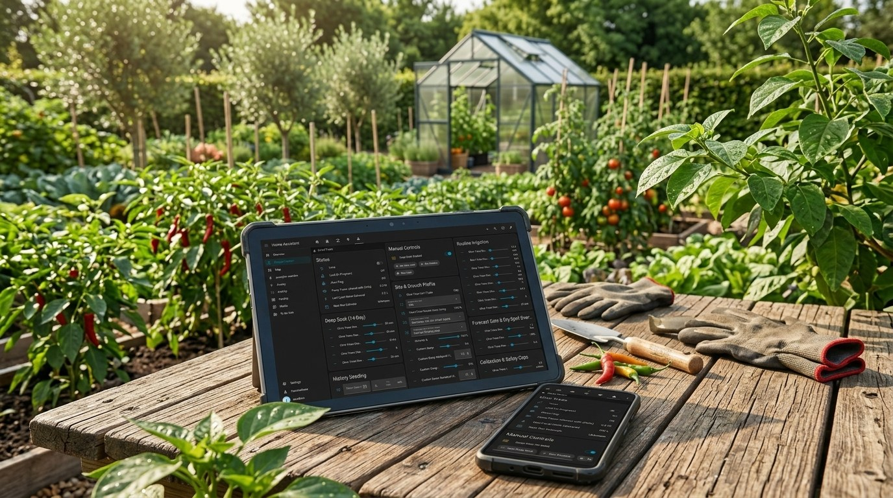

# ZoneFlow Irrigation

A native Home Assistant custom integration for drip/valve irrigation, built
as real Python (config flow, entities, services) rather than a pile of YAML
automations and helper entities. It drives your existing valve, pump, rain
gauge, and outdoor temperature sensor directly — it never creates new
physical entities of its own.

## Screenshots

## 🤖 Let an AI set it up for you

**[AI_SETUP.md](./AI_SETUP.md)** is a step-by-step setup guide written *for
an AI assistant to follow*, not for you to read. Paste its raw contents (or
just its link, if your assistant can open it) into Claude, ChatGPT, or any
other AI assistant along with "help me set up ZoneFlow", and it will
interview you for your entities and plant/crop details, recommend sensible
values (including the per-crop numbers like weekly water targets and the
weather forecast dry-spell override), and get a zone fully configured and
verified — no need to read any of the documentation below first.

It doesn't just plug in generic defaults: it factors in your crop, your
region/climate (tropical, temperate, arid, etc.), and your soil type to
recommend realistic weekly water targets and temperature thresholds for
*your* conditions, explaining its reasoning as it goes rather than handing
you a number with no justification. It can also, on request, generate a
ready-to-paste Home Assistant dashboard card for the zone — grouping the
schedule, live sensors, and manual controls into one clean view.

Two ways it can do that, and it'll ask you which you want:
- **It clicks for you** — if it has tool/API access to your Home Assistant
  instance (an MCP server, a long-lived access token, etc.), it can create
  the config entry and set every tunable number itself, just narrating what
  it's doing.
- **It guides you** — if not (or if you'd rather do the clicking yourself),
  it tells you exactly what to click and type, one screen at a time.

Either way you end up in the same place: a working, tuned zone, with a
verification test pulse run before it calls the job done.

## What it does

- **Two watering cadences per zone**: an infrequent **deep soak** (encourages
  deep root growth) and a frequent, lighter **routine irrigation** — each on
  its own configurable schedule and independently gated.
- **Rain-aware**: tracks rolling rain windows (30min through 14 days) from a
  tipping-bucket counter, deducts recent rainfall from how much a routine
  cycle needs to apply, and holds off entirely during a configurable
  dry-down period after significant rain.
- **Temperature-aware**: a 3-day average peak temperature shifts both the
  watering interval and the weekly water target between "cool", "normal",
  and "hot" tiers. Works whether Home Assistant is set to °C or °F.
- **Metric or imperial**: each zone shows its sliders and sensors in mm/°C
  or inches/°F/gallons -- by default whatever Home Assistant is set to, or
  forced per zone in its options. ZoneFlow calculates in metric internally,
  so the choice never changes how much it waters, and switching keeps every
  setting's value.
- **ET curve, optional**: switch a zone's Water Demand Model to the ET
  curve and its weekly target follows the weather continuously instead of
  jumping between three tiers -- reference evapotranspiration (ET₀,
  Hargreaves-Samani, from the daily min/max temperature and your home
  latitude) x 7 x a per-zone crop factor. No extra sensors needed, off by
  default, and it falls back to the tiers on its own if the temperature
  sensor drops out. A Routine Weekly Target sensor shows which model is in
  effect.
- **Safety watchdogs, not just a scheduler**: a stuck-valve force-off, a
  power-loss mid-cycle abort, a pump-power audit per pulse, and a stale-lock
  auto-recovery on Home Assistant restart. All of it — scheduled runs and
  manual button/service calls alike — goes through the exact same code path,
  so a manual run can never drift from what the schedule would have done.
- **Tunable, not hardcoded**: every threshold (weekly mm targets, flow rate,
  drydown days, safety runtime caps, rain-efficiency curve) is a Home
  Assistant `number` entity you can adjust live, with sensible defaults.
- **Multi-zone, any pump topology**: add the integration again for each zone
  (own name, own valve, own targets) and it just works whether every zone has
  its own independent pump or several zones share one pump feeding multiple
  valves. Sharing is auto-detected — if two zones are pointed at the same
  pump-power sensor, they automatically take turns instead of both trying to
  run the pump at once; nothing to configure. A pump preamble/postamble delay
  (spin-up before the valve opens, pressure-settle after it closes) is
  available per zone for pumps that need a moment to reach pressure.
- **Sunrise/sunset-relative scheduling, optional**: deep-soak and routine
  triggers default to a fixed clock time, same as always, but either can
  instead be set to fire a chosen number of minutes before/after sunrise or
  sunset — useful across seasons and latitudes where a fixed 05:00 drifts
  relative to daylight.
- **Weather forecast gate, optional**: point a zone at any `weather.*` entity
  and it will pre-emptively hold off a scheduled run when rain is forecast
  (by mm and/or probability, both adjustable), checking again at the next
  scheduled run instead of watering into the rain. If the forecast has no
  weather entity configured, is missing, or is unavailable, this gate never
  blocks anything — it fails open by design. A **dry-spell override** number,
  adjustable per zone right in the UI, caps how many days a zone can go
  un-watered on a forecast that never delivers: once that many days pass with
  zero rain actually measured, ZoneFlow waters anyway. Set it low for a
  thirsty seedling bed, higher for a drought-tolerant succulent zone — each
  zone/crop can have its own tolerance.
- **Seed a zone's history at setup**: a brand-new zone has no watering
  history, which correctly (but often unhelpfully) makes it look overdue and
  fire on the very next scheduled time. Each zone gets three `datetime`
  entities — Last Routine Irrigation, Last Deep Soak, Last Significant Rain —
  you can set right after adding the zone (or any time after, to correct
  them) so an already-established plant doesn't get double-watered just
  because you're migrating it onto ZoneFlow. Leave them unset for a genuinely
  brand-new setup; the corresponding gate then behaves exactly as if it's
  never happened.

## Installation

**Via HACS (recommended):**

1. HACS → ⋮ (top right) → **Custom repositories** → add
   `https://github.com/Dreamer41/ha-smart-irrigation` as type **Integration**.
   (Once this repo is accepted into HACS's default store, this manual step
   won't be needed — you'll be able to just search for "ZoneFlow" in HACS
   directly.)
2. Find **ZoneFlow Irrigation** in HACS and click **Download**.
3. Restart Home Assistant (custom integrations need a full restart to be
   picked up the first time).

**Manual install (alternative):**

1. Copy `custom_components/zoneflow/` into your HA `/config/custom_components/`.
2. Restart Home Assistant (custom integrations need a full restart to be
   picked up the first time).

**Then, either way:**

3. Settings → Devices & Services → Add Integration → **ZoneFlow Irrigation**.
4. Give the zone a short name (e.g. "Front Lawn") — this becomes its device
   name and its default CSV filename, so multiple zones never collide.
5. Point it at your real entities:
   - a `switch.*` valve
   - a `sensor.*` pump power sensor
   - a `counter.*` or `sensor.*` rain gauge tip counter
   - a `sensor.*` outdoor temperature sensor (device class `temperature`)
   - (optional) a `notify.*` entity for phone alerts
   - (optional) a `weather.*` entity to enable the forecast gate (see above)
   - a CSV log file path
   - deep-soak and routine schedule times, or a sunrise/sunset-relative
     trigger instead (see above)
6. If this zone's plant already has recent watering/rain history (e.g.
   you're migrating it from another system), set its Last Routine
   Irrigation / Last Deep Soak / Last Significant Rain `datetime` entities
   now, before leaving it to run unattended — otherwise it looks overdue
   from a blank slate and will water on the very next scheduled time
   regardless of whether it actually needs it yet.
7. To add another zone, repeat from step 3 with a different name/entities. If
   it shares a pump-power sensor with an existing zone, pump-sharing kicks in
   automatically.

## Also included

- **Deep-soak interval, adjustable**: how many days between deep-soak cycles
  is its own `number` slider (default 14, 3-30 days) instead of a fixed
  constant -- tune it per zone right from the dashboard, same as every other
  threshold.
- **Days Until Next Run sensor**: a plain-language countdown to whichever
  comes first, the next routine cycle or the next deep soak, so you can see
  at a glance whether a zone is about to water without doing the math from
  the raw timestamps yourself.
- **Health journal**: a per-zone `select` (Excellent / Good / Poor / Sick)
  plus a free-text notes field, purely for you to record how the plant's
  actually doing over time, along with a Last Fertilizing date and a Next
  Fertilizing In dropdown (1-12 months). Nothing in ZoneFlow reads any of
  them back -- it
  never changes scheduling or watering amounts -- it's just a place to keep
  that context next to the zone instead of in a separate notebook.
- **Snooze Today button**: skip whichever of today's scheduled cycles (deep
  soak, routine, or both) hasn't run yet, without touching the schedule,
  targets, or any other gate -- everything's back to normal starting
  tomorrow with no further action needed.
- **Optional soil-moisture input**: point a zone at a `sensor.*` soil
  moisture entity (with adjustable dry/wet % thresholds) and it becomes the
  direct decider for routine irrigation at the extremes -- dry soil waters
  even if the modeled interval isn't due yet, wet soil skips even if it's
  overdue. In the ambiguous middle band, or if the sensor is unconfigured or
  currently unreadable, it defers entirely to the existing modeled schedule
  -- this is a pure addition, never a replacement, and fully inert if you
  don't set it up.
- **Self-tuning routine interval**: ZoneFlow quietly learns from how you use
  the manual controls. Press "Run Routine Irrigation Now" three times in a
  row while the model still thinks it isn't due yet, and it shortens the
  Routine Dry-Down Holdoff slider a notch -- you keep telling it the plant
  needs water sooner than it thinks. Do the same with "Snooze Today" three
  times running, and it lengthens that same slider instead. Either pattern
  resets the other, the nudge is clamped to the slider's normal safe range,
  and you can always override it by hand at any time -- a self-tune nudge is
  just the same slider move a human could make, nothing more.

## Recommended cutover

If you're replacing an existing YAML-based irrigation automation:

1. **Install alongside your existing automations first — don't disable them
   yet.** Let your tree/lawn keep getting watered on the schedule you trust
   while you verify this one.
2. **Bench-test the wiring** at a time when it's fine for the valve to click
   on for a few seconds, via `Developer Tools → Actions →
   zoneflow.test_pulse` (seconds: 10). This bypasses every schedule/rain/
   dry-down gate on purpose — it's the one place in this integration that
   does — so you can confirm the valve switches, the pump-power sensor reads
   correctly, and a CSV row lands in your log file.
3. **Compare the diagnostic sensors** (rolling rain windows, 3-day average
   peak temperature, next-irrigation estimate) against whatever your old
   setup reported, for a few days, before letting this integration control
   the valve on schedule.
4. **Only once those match**, disable your old automation(s) and let this
   integration run the actual scheduled cycles.
5. **Rollback plan**: if anything looks wrong after cutover, re-enable your
   old automation and disable this integration's config entry (Settings →
   Devices & Services → ZoneFlow Irrigation → ⋮ → Disable). They read the
   same physical entities but keep entirely separate internal state, so
   neither can corrupt the other's bookkeeping.

## Services

- `zoneflow.run_deep_soak` / `run_routine_irrigation` — same gates as the
  schedule.
- `zoneflow.reset_lock` — emergency mutex clear.
- `zoneflow.test_pulse` (seconds, default 10) — bench-test only, bypasses
  all gates.

## Testing

- `tests/` — an automated pytest suite (`pip install -r requirements-test.txt`,
  then `pytest tests/ -q`) that boots a real Home Assistant core in-process
  and fast-forwards simulated time to exercise every gate, watchdog, and
  edge case in milliseconds.
- `scripts/simulate_season.py` — a fast, pure-Python simulator that runs the
  same watering-decision math against synthetic weather (dry spell, monsoon
  burst, mixed season, or random) to sanity-check behaviour over weeks or
  months in under a second: `python scripts/simulate_season.py --scenario mixed`.
- `sandbox/` — a Docker Compose setup that runs a real, fully isolated Home
  Assistant instance with simulated valve/pump/rain/temperature entities you
  control from sliders, for clicking around the actual UI before touching a
  real valve.

## License

[MIT](./LICENSE) — use it, modify it, redistribute it, just keep the
copyright notice.
