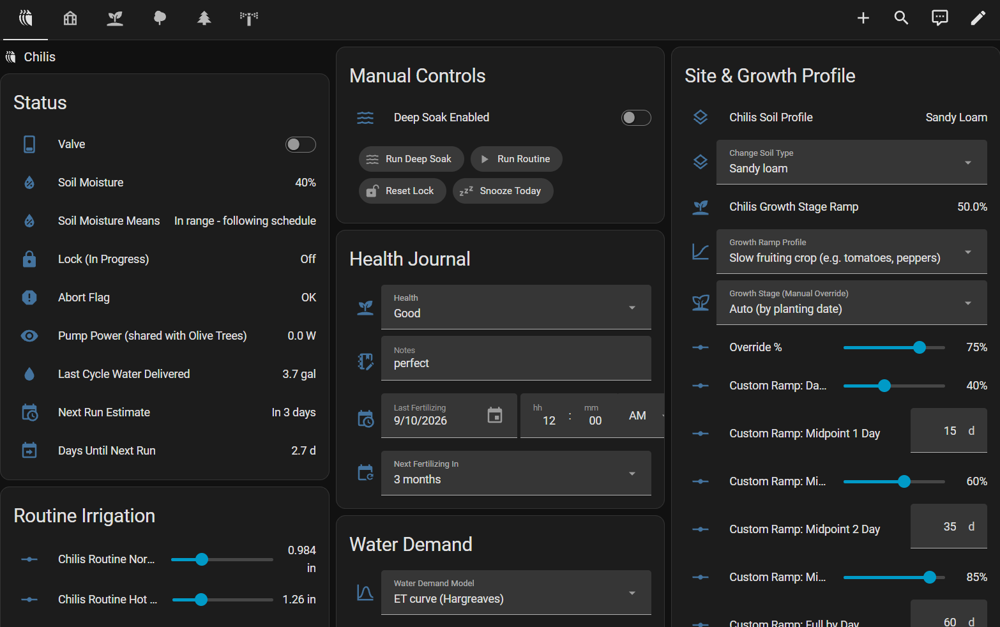

# ZoneFlow Irrigation

A native Home Assistant custom integration for drip, sprinkler and valve
irrigation, written as real Python (config flow, entities, services) rather
than a pile of YAML automations and helpers. It drives the valve, pump and
sensors you already have — it never creates physical entities of its own.

**Only a valve switch is required.** Every sensor is optional, each one adds
a specific capability, and each zone can use a different combination. A
sensor that goes offline later degrades that capability safely instead of
breaking the zone.

## Screenshots

## 🤖 Let an AI set it up for you

**[AI_SETUP.md](./AI_SETUP.md)** is a step-by-step guide written *for an AI
assistant to follow*, not for you to read. Paste it (or its link) into
Claude, ChatGPT or another assistant with "help me set up ZoneFlow". It
interviews you — how many zones, what you're growing and where, which
sensors each zone has, which zones share a pump — researches your crop,
recommends numbers for your climate and soil with its reasoning, configures
each zone (itself if it has Home Assistant tool access, or by telling you
what to click), and runs a test pulse before it calls the job done. It can
also generate a dashboard card and a plain-language cheat sheet per zone.

The rest of this page is the human overview. AI_SETUP.md is the detailed
reference for every setting.

## How it decides

Each zone runs two cadences: an infrequent **deep soak** (for deep roots)
and a lighter, frequent **routine irrigation**. A completed deep soak also
counts as the routine watering, so the routine interval restarts from it
— no full routine dose the morning after a soak. Every run, scheduled or
manual, goes through the same pipeline:

1. **Plant and site** — crop, soil type, drainage, slope and irrigation
   method (descriptive; they guide the recommended numbers), plus an
   optional growth-stage ramp from a planting date.
2. **Demand** — how much water, how often:
   - temperature tiers (cool / normal / hot) from the 3-day average of daily
     highs, with thresholds chosen for your climate at setup;
   - or, optionally, an **ET curve**: Hargreaves ET₀ from daily min/max
     temperature and your latitude × 7 × a crop factor;
   - scaled by the **growth ramp** (young plants need less) and optional
     **deficit mode** (controlled stress after fruit set, with guardrails);
   - an optional **soil-moisture probe** decides at the extremes: dry soil
     brings watering forward, wet soil skips it.
3. **Water already received** — rolling rain windows from a tipping-bucket
   gauge, rain credit deducted by efficiency band, a dry-down hold after
   significant rain, an optional **weather forecast gate**, and a
   30-minute pre-irrigation rain check that also stops a running cycle.
4. **Physical delivery** — runtime from your calibrated emitter flow rate,
   split into pulses with soak gaps (so clay can absorb it), optional pump
   pre/post delays, and serialized access to a **shared pump**.
5. **Safety** — per-cycle and daily runtime caps, stuck-valve force-off,
   pump-power audit, no-flow detection, power-loss abort, stale-lock
   recovery, and interruption handling that always ends with the valve
   closed and confirmed.

## What each sensor adds

| Entity | Adds | Without it |
|---|---|---|
| `switch.*` valve | — | **required** |
| Rain gauge tip counter (`counter.*`/`sensor.*`) | rain credit, dry-down hold, rain stop | waters as if it never rains |
| Outdoor temperature sensor | automatic hot/cool tiers, ET curve, deficit heat guard | the **Fallback / Manual Temperature** slider picks the tier — move it by hand for a heat wave or cold spell |
| Soil-moisture probe (`sensor.*`, %) | dry soil waters early, wet soil skips | the modeled schedule alone |
| Pump power sensor | per-pulse "is the pump really running" audit | no low-power warning |
| Flow meter (cumulative volume) | measured water per cycle, "pump ran but no water moved" alert | no measured delivery, no no-flow check |
| `weather.*` forecast | holds off before forecast rain, with a dry-spell override | forecast never blocks |
| `notify.*` target | phone alerts for faults and notable events | log only |

Sensors can be shared between zones (one rain gauge or weather entity for
the whole garden); the valve and a soil probe belong to one zone.

**When a sensor misbehaves:**
- **Temperature:** a short dropout keeps using the last real days. After 3
  days with no reading, the fallback slider decides until it recovers.
- **Rain gauge:** unreadable values are ignored, not recorded as zero, and a
  counter reset or glitch doesn't lose rain already counted.
- **Soil moisture:** the schedule decides whenever the reading can't be
  used — offline, impossible (outside 0–100%), or a dry reading with no
  report for 24 hours. A wet reading is still trusted (probes often sit at
  100% in soaked soil), but if wet readings hold watering back for twice
  the routine interval you get an alert, and if the probe has also stopped
  reporting, the schedule waters once and the check starts over.
- **Pump power:** a warning, and the cycle still completes.
- **Flow meter:** the no-flow check is skipped rather than raising a false
  alarm.
- **Weather:** the forecast gate fails open and never blocks a run.

## Multiple zones and shared pumps

Add the integration once per zone — each has its own name, valve, targets
and schedule, and any mix of sensors.

**Shared pump ID.** If several zones draw from the same physical pump, give
them the **same "Shared pump ID"** (any label, e.g. `Pump A`) in the setup
form or the zone's **Configure** options. Zones with the same ID take turns:
one zone holds the pump for its whole cycle, soak gaps included, and the
next waits. Zones with a different ID, or none, run independently and can
overlap. This works with or without a pump-power sensor — ZoneFlow only
falls back to "same pump-power sensor = same pump" when no ID is set, which
is how older setups grouped zones, so set the ID explicitly for any shared
pump. One flow meter in front of several separate pumps can't tell their
water apart: give those zones the same pump ID too if you want each zone's
measured water to be its own (they then take turns), or fit a meter per
pump.

**Shared pump safety** matters: two valves open on one pump split its flow,
and both zones get less water than their calibrated runtime assumes.

## More features

- **Tunable live**: every threshold is a `number` entity with a sensible
  default — weekly targets per tier, hot/cool thresholds, emitter flow
  rate, pulse count and soak time per cadence, dry-down days, deep-soak
  interval and depth, rain efficiency, forecast thresholds, runtime caps.
- **Climate at setup**: pick tropical, hot summers, temperate or cool
  summers, and the hot/cool thresholds and fallback temperature are
  pre-filled for you (sliders: hot 15–45 °C, cool 5–40 °C).
- **Growth-stage ramp**: Fast Annual, Slow Fruiting, Established Perennial
  or your own custom curve, from a planting date — or jump straight to a
  stage preset from a dropdown.
- **Sunrise/sunset scheduling**: either cadence can fire a set number of
  minutes before/after sunrise or sunset instead of at a fixed time.
- **Metric or imperial per zone**: mm/°C or inches/°F/gallons, following
  Home Assistant by default. Everything is calculated in metric, so the
  choice never changes how much it waters.
- **At-a-glance sensors**: next irrigation estimate, days until next run,
  weekly target and where it came from, rain windows, reference ET₀,
  measured last-cycle water, soil-moisture status, deficit-mode status.
- **History you can seed**: Last Routine / Last Deep Soak / Last Significant
  Rain dates, so a migrated plant isn't treated as overdue. Past dates only
  (a typo'd future date would silently keep the zone dry).
- **Service runs for checks and maintenance**: every zone has **Service
  Run 1 / 5 / 10 min** buttons and a **Service Mode** switch (valve on until
  you switch it off, with an automatic switch-off after 30 minutes by
  default and a phone alert). For checking drippers, flushing lines or
  finding leaks — they go through the same safety path as a real cycle
  (lock, shared pump, watchdogs) but never count as watering, so the
  schedule doesn't move. Their minutes do count toward the daily safety
  cap.
- **Snooze Today**, a **deep-soak on/off switch**, and **self-tuning**: three
  "water now" presses in a row while the model says not yet shorten the
  routine dry-down a notch; three snoozes lengthen it.
- **Health journal**: condition, notes, last/next fertilizing — for you only,
  never read by the watering logic.
- **CSV event log** per zone: every run, skip and warning with the numbers
  behind it.

## Dashboard

One zone's page (a chili bed with a soil-moisture probe): live status up
top, manual controls, the health journal, and every tunable as a slider.
The AI setup guide builds a page like this for each of your zones.

## Installation

**Via HACS (recommended):**

1. HACS → ⋮ → **Custom repositories** → add
   `https://github.com/Dreamer41/ha-smart-irrigation` as type
   **Integration**.
2. Find **ZoneFlow Irrigation** and click **Download**.
3. Restart Home Assistant.

**Manual:** copy `custom_components/zoneflow/` into
`/config/custom_components/` and restart Home Assistant.

**Add a zone:** Settings → Devices & Services → Add Integration →
**ZoneFlow Irrigation**. Four short screens:

1. **Zone name** (becomes the device name and default CSV file name).
2. **Entities and schedule** — the valve, any optional sensors from the
   table above, the Shared pump ID if the pump is shared, units, soil/site
   description, growth ramp, CSV path, deep-soak on/off and both schedules.
3. **Climate** — pre-fills the next screen.
4. **Temperature thresholds** — hot, cool and fallback temperature, in the
   zone's units.

Then, before leaving it to run: set the emitter flow rate (the one number
that must be right — a **Service Run 5 min** press is an easy way to
measure it), seed the Last Routine / Deep Soak dates if the plant already
has a watering history, and press **Service Run 1 min** to confirm the
valve, pump and log. Add further zones the same way; sensors can be
added or removed later under **Configure**.

## Recommended cutover

If you're replacing an existing YAML-based irrigation automation:

1. **Install alongside your existing automations — don't disable them
   yet.**
2. **Bench-test the wiring** with the zone's **Service Run 1 min** button
   (or `zoneflow.test_pulse`, seconds: 10). Both bypass every schedule and
   rain gate on purpose and never count as watering, so you can confirm the
   valve switches, the pump-power sensor or flow meter reads, and a CSV row
   lands in the log.
3. **Compare the diagnostic sensors** (rain windows, 3-day average peak
   temperature, next-irrigation estimate) with your old setup for a few
   days.
4. **Only then** disable the old automation(s) and let ZoneFlow run the
   schedule.
5. **Rollback**: re-enable the old automation and disable the ZoneFlow
   entry (Settings → Devices & Services → ZoneFlow Irrigation → ⋮ →
   Disable). They keep separate state, so neither corrupts the other.

## Services

Each targets a zone (any of its entities or its device).

- `zoneflow.run_deep_soak` / `zoneflow.run_routine_irrigation` — run now,
  through the same gates as the schedule.
- `zoneflow.snooze_today` — skip today's remaining cycles.
- `zoneflow.reset_lock` — emergency clear of a stuck in-progress lock.
- `zoneflow.test_pulse` (seconds, default 10) — bench test; bypasses all
  gates.

## Testing

- `tests/` — pytest suite (`pip install -r requirements-test.txt`, then
  `pytest tests/ -q`) that boots a real Home Assistant core in-process and
  fast-forwards time through every gate, watchdog, interruption, sensor
  dropout, multi-zone pump handoff and season scenario.
- `scripts/simulate_season.py` — a fast pure-Python season simulator
  (`--scenario dry|monsoon|mixed`) for sanity-checking behaviour over weeks
  or months.
- `sandbox/` — Docker Compose for a fully isolated Home Assistant with
  simulated valves, pumps, rain, temperature and soil probes you control
  from sliders, for trying the real UI before touching a real valve.

## License

[MIT](./LICENSE) — use it, modify it, redistribute it, just keep the
copyright notice.
