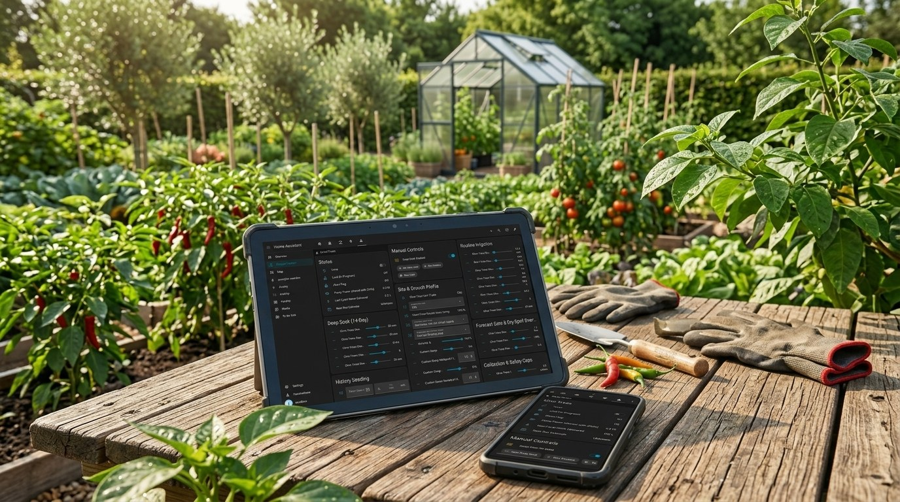
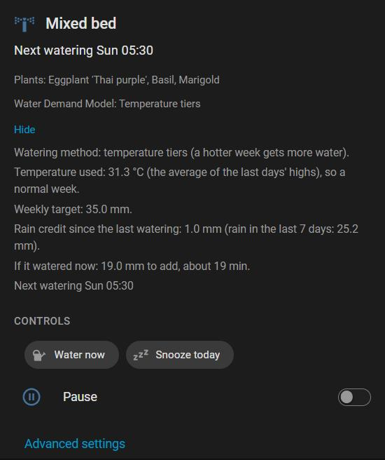
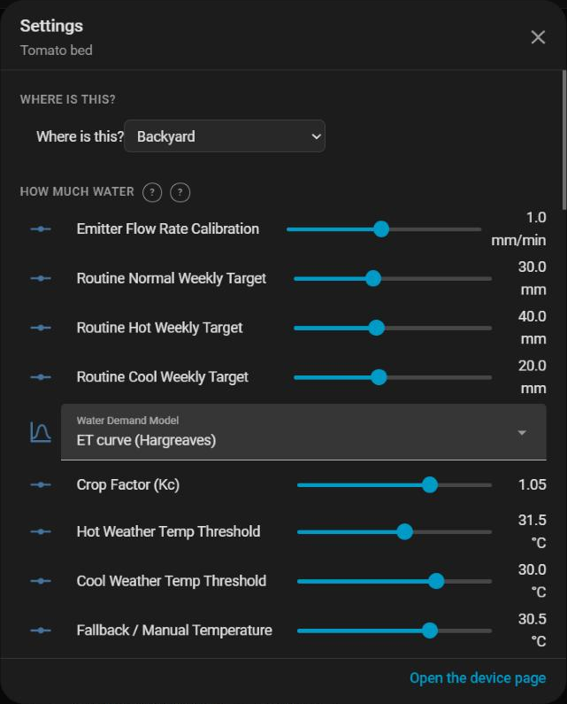
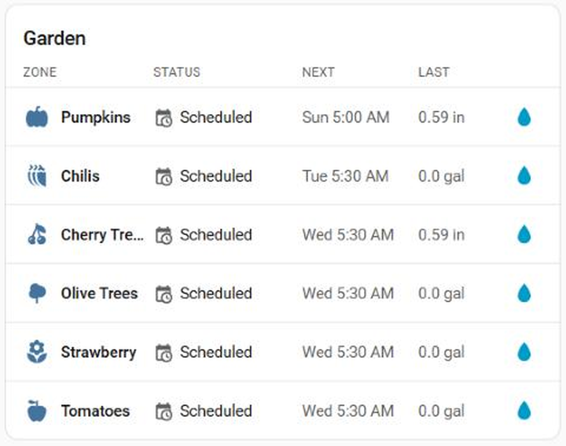
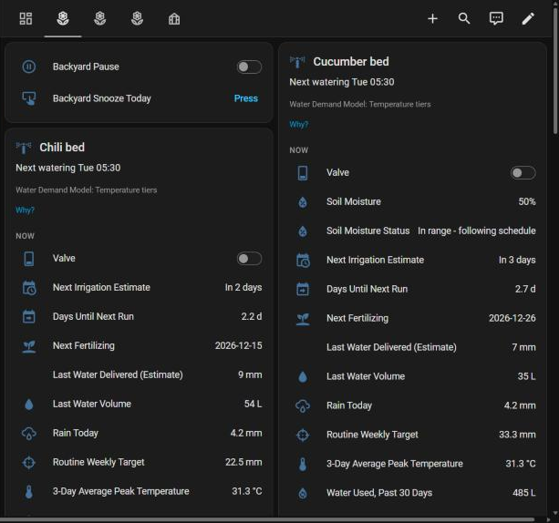

# ZoneFlow Irrigation

**Website:** [zoneflowirrigation.com](https://zoneflowirrigation.com/)

**ZoneFlow is a smart irrigation integration for Home Assistant** for
gardens, lawns, vegetable beds, fruit trees and other plants (install with
HACS). It works out when and how much each zone needs — from the plant,
the soil, the slope, the temperature and the rain, and optionally a
soil-moisture probe, a flow meter and the weather forecast — and tells you
in plain words why it watered or skipped. It works with drip lines,
sprinklers and soaker hoses, multiple zones and shared pumps.

**Only a valve switch is required.** Every sensor is optional, each one adds
a specific capability, and each zone can use a different combination. A
sensor that goes offline later degrades that capability safely instead of
breaking the zone.

**At a glance**

- **Automatic watering per zone**: a light, frequent routine watering and
  an occasional deep soak, from temperature tiers or an evapotranspiration
  (ET) curve with a crop factor (Kc).
- **Plant, soil and slope aware**: plant presets at setup, and **cycle and
  soak** — each watering is split into as many pulses as the soil takes in
  without runoff, with extra pulses on a slope.
- **Rain and weather**: rain credit from a rain gauge, a dry-down pause
  after heavy rain, a forecast skip, a frost guard, and a rain stop during
  a running cycle.
- **Says why**: a plain-language Status per zone ("Skipped: the soil is
  wet (72%)"), phone notifications and a weekly summary.
- **Safety first**: runtime caps, stuck-valve watchdog, pump and flow
  checks, power-loss handling — a cycle always ends with the valve closed.
- **Built-in dashboard cards**, flow-rate calibration helper, fertilizing
  reminders, 19 languages, no YAML, and an optional **AI-assisted setup**.

## Screenshots



## 🤖 Let an AI set it up for you

**[AI_SETUP.md](./AI_SETUP.md)** is a step-by-step guide written *for an AI
assistant to follow*, not for you to read. Paste it (or its link) into
Claude, ChatGPT or another assistant with "help me set up ZoneFlow". It
interviews you — how many zones, what you're growing and where, which
sensors each zone has, which zones share a pump — researches your crop,
recommends numbers for your climate and soil with its reasoning, configures
each zone (itself if it has Home Assistant tool access, or by telling you
what to click), and runs a test pulse before it calls the job done. It can
also generate a dashboard card and a plain-language cheat sheet per zone.

The rest of this page is the human overview. AI_SETUP.md is the detailed
reference for every setting.

## How ZoneFlow decides when and how much to water

Each zone runs two cadences: an infrequent **deep soak** (for deep roots)
and a lighter, frequent **routine irrigation**. A completed deep soak also
counts as the routine watering, so the routine interval restarts from it
— no full routine dose the morning after a soak. Every run, scheduled or
manual, goes through the same pipeline:

1. **Plant and site** — crop, soil type, drainage, slope and irrigation
   method (soil, drainage and slope decide cycle and soak — see below), plus an
   optional growth-stage ramp from a planting date.
2. **Demand** — how much water, how often:
   - temperature tiers (cool / normal / hot) from the 3-day average of daily
     highs, with thresholds chosen for your climate at setup;
   - or, optionally, an **ET curve**: Hargreaves ET₀ from daily min/max
     temperature and your latitude × 7 × a crop factor;
   - scaled by the **growth ramp** (young plants need less) and optional
     **deficit mode** (controlled stress after fruit set, with guardrails);
   - an optional **soil-moisture probe** decides at the extremes: dry soil
     brings watering forward, wet soil skips it.
3. **Water already received** — rolling rain windows from a tipping-bucket
   gauge, rain credit deducted by efficiency band, a dry-down hold after
   significant rain, an optional **weather forecast gate**, and a
   30-minute pre-irrigation rain check that also stops a running cycle.
4. **Physical delivery** — runtime from your calibrated emitter flow rate,
   split into pulses with soak gaps (**cycle and soak**: as many pulses as
   the soil takes in without runoff — about 3 mm per pulse on clay, 15 mm
   on loam, 30 mm on sand, less with slow drainage — one more on a
   moderate slope and two on a steep one, with 30 minutes between pulses
   or an hour on clay and slow-draining soil), optional pump
   pre/post delays, and serialized access to a **shared pump**.
5. **Safety** — per-cycle and daily runtime caps, stuck-valve force-off,
   pump-power audit, no-flow detection, power-loss abort, stale-lock
   recovery, and interruption handling that always ends with the valve
   closed and confirmed.

## Sensors: what each one adds (all optional except the valve)

| Entity | Adds | Without it |
|---|---|---|
| `switch.*` valve | — | **required** |
| Rain gauge tip counter (`counter.*`/`sensor.*`) | rain credit, dry-down hold, rain stop | waters as if it never rains |
| Outdoor temperature sensor | automatic hot/cool tiers, ET curve, deficit heat guard, frost guard | the **Fallback / Manual Temperature** slider picks the tier — move it by hand for a heat wave or cold spell |
| Soil-moisture probe (`sensor.*`, %) | dry soil waters early, wet soil skips | the modeled schedule alone |
| Pump power sensor | per-pulse "is the pump really running" audit | no low-power warning |
| Flow meter (cumulative volume) | measured water per cycle, "pump ran but no water moved" alert | no measured delivery, no no-flow check |
| `weather.*` forecast | holds off before forecast rain, with a dry-spell override; its current temperature feeds the frost guard when there's no temperature sensor | forecast never blocks |
| `notify.*` target | phone alerts for faults and notable events | log only |

Sensors can be shared between zones (one rain gauge or weather entity for
the whole garden); the valve and a soil probe belong to one zone.

**When a sensor misbehaves:**
- **Temperature:** a short dropout keeps using the last real days. After 3
  days with no reading, the fallback slider decides until it recovers.
- **Rain gauge:** unreadable values are ignored, not recorded as zero, and a
  counter reset or glitch doesn't lose rain already counted.
- **Soil moisture:** the schedule decides whenever the reading can't be
  used — offline, impossible (outside 0–100%), or a dry reading with no
  report for 24 hours. A wet reading is still trusted (probes often sit at
  100% in soaked soil), but if wet readings hold watering back for twice
  the routine interval you get an alert, and if the probe has also stopped
  reporting, the schedule waters once and the check starts over.
- **Pump power:** a warning, and the cycle still completes.
- **Flow meter:** the no-flow check is skipped rather than raising a false
  alarm.
- **Weather:** the forecast gate fails open and never blocks a run.

## Multiple irrigation zones and shared pumps

Add the integration once per zone — each has its own name, valve, targets
and schedule, and any mix of sensors.

**Shared pump ID.** If several zones draw from the same physical pump, give
them the **same "Shared pump ID"** (any label, e.g. `Pump A`) in the setup
form or the zone's **Configure** options. Zones with the same ID take turns:
one zone holds the pump for its whole cycle, soak gaps included, and the
next waits. Zones with a different ID, or none, run independently and can
overlap. This works with or without a pump-power sensor — ZoneFlow only
falls back to "same pump-power sensor = same pump" when no ID is set, which
is how older setups grouped zones, so set the ID explicitly for any shared
pump. One flow meter in front of several separate pumps can't tell their
water apart: give those zones the same pump ID too if you want each zone's
measured water to be its own (they then take turns), or fit a meter per
pump.

**Shared pump safety** matters: two valves open on one pump split its flow,
and both zones get less water than their calibrated runtime assumes.

## More features

- **Tidy device page**: settings sit under *Configuration*, technical
  sensors under *Diagnostic*, and anything a zone can't use (forecast
  sliders without a weather entity, rain sliders without a gauge, deep-soak
  sliders with deep soak off…) is hidden — still working, still keeping its
  value, back by itself when you set that feature up. A **Download
  diagnostics** button gives everything needed for a bug report.
- **Status in plain words**: each zone's **Status** sensor says what it
  is doing and why, in Home Assistant's language — "Routine watering done
  at 05:30: 12 mm in 40 min · next Mon 05:30", "Skipped: the soil is wet
  (72%)", "Skipped: 8 mm of rain forecast". Its `code` attribute is the
  same thing as a stable key for automations.
- **Notifications your way**: per zone, all phone notifications, warnings
  only (faults and anything that needs a look) or none — except an alert
  that a valve may still be open, which always comes through. Notifications and
  the status follow Home Assistant's language; the CSV log stays in
  English.
- **Tunable live**: every threshold is a `number` entity with a sensible
  default — weekly targets per tier, hot/cool thresholds, emitter flow
  rate, pulse count and soak time per cadence, dry-down days, deep-soak
  interval and depth, rain efficiency, forecast thresholds, runtime caps.
- **Climate at setup**: pick tropical, hot summers, temperate or cool
  summers, and the hot/cool thresholds and fallback temperature are
  pre-filled for you (sliders: hot 15–45 °C, cool 5–40 °C).
- **Growth-stage ramp**: Fast Annual, Slow Fruiting, Established Perennial
  or your own custom curve, from a planting date — or jump straight to a
  stage preset from a dropdown.
- **Sunrise/sunset scheduling**: either cadence can fire a set number of
  minutes before/after sunrise or sunset instead of at a fixed time.
- **Metric or imperial per zone**: mm/°C or inches/°F/gallons, following
  Home Assistant by default. Everything is calculated in metric, so the
  choice never changes how much it waters.
- **At-a-glance sensors**: next irrigation estimate, days until next run,
  weekly target and where it came from, rain windows, reference ET₀,
  measured last-cycle water, soil-moisture status, deficit-mode status.
- **History you can seed**: Last Routine / Last Deep Soak / Last Significant
  Rain dates, so a migrated plant isn't treated as overdue. Past dates only
  (a typo'd future date would silently keep the zone dry).
- **Service runs for checks and maintenance**: every zone has **Service
  Run 1 / 5 / 10 min** buttons and a **Service Mode** switch (valve on until
  you switch it off, with an automatic switch-off after 30 minutes by
  default and a phone alert). For checking drippers, flushing lines or
  finding leaks — they go through the same safety path as a real cycle
  (lock, shared pump, watchdogs) but never count as watering, so the
  schedule doesn't move. Their minutes do count toward the daily safety
  cap.
- **Pause** switch per zone: no watering, scheduled or "run now", until
  it's switched off — or set **Paused Until** and Pause switches itself
  off then. For winter, a holiday or a repair. Safety watchdogs and service
  runs keep working, and the paused weeks don't count as "overdue"
  afterwards.
- **Frost guard** (with a temperature sensor, or else the weather entity's
  current temperature): a due cycle waits while it's below 2 °C
  (adjustable), re-checks every hour for a few hours, and only then waits
  for the next day. Set it to its lowest to switch it off.
- **Weekly summary** (optional, per zone): pick a weekday and at 18:00 you
  get one message per phone for all its zones — water given, rain, how
  often a run was held back, and the next watering.
- **Repairs**: an unavailable valve, a sensor offline for days, a missing
  notify target or a never-calibrated flow rate show up in Settings →
  System → Repairs, and clear themselves once fixed.
- **Snooze Today**, a **deep-soak on/off switch**, and **self-tuning**: three
  "water now" presses in a row while the model says not yet shorten the
  routine dry-down a notch; three snoozes lengthen it.
- **Health journal**: condition and notes — for you only, never read by
  the watering logic.
- **Fertilizing reminders**: set the Last Fertilizing date (or press
  **Fertilized Today**) and a Fertilizing Interval (1–3 weeks or 1–12
  months); **Next Fertilizing** shows the due date, both cards show it, and
  a phone message reminds you on the day (not while the zone is paused).
  Fertilizing never changes the watering.
- **CSV event log** per zone: every run, skip and warning with the numbers
  behind it.

## Dashboard

**The ZoneFlow card comes with the integration** — nothing to install or
add as a resource. Edit a dashboard → **Add card** → **ZoneFlow zone** →
pick the zone. Or in YAML:

```yaml
type: custom:zoneflow-card
device_id: <the zone's device>   # picked for you in the card editor
show_journal: true               # Plant journal button
show_settings: true              # Settings button: every setting, grouped
show_diagnostics: false          # Diagnostics button
title: Chili bed                 # optional: instead of the zone's name
icon: mdi:chili-hot              # optional
```



It shows the zone's Status sentence up top, then the valve, soil moisture
and next watering, the controls (water now, snooze, pause) and service
runs. **Plant journal** and **Settings** at the bottom open in a popup,
like Home Assistant's own entity dialogs: every setting in groups, and a
link to the zone's device page (for admins).



It finds the zone's entities
through its device and leaves out whatever the zone doesn't use, so after
a ZoneFlow update new features appear on it by themselves. Units follow
the zone. Ordinary Home Assistant cards keep working alongside it.

ZoneFlow also adds a small loader, `/local/zoneflow/zoneflow-loader.js`, to
Settings → Dashboards → Resources (the file lives in `/config/www/zoneflow/`).
It makes the cards show up on a dashboard opened while Home Assistant is
still starting; removing ZoneFlow removes both. **Dashboards in YAML mode**
(`lovelace: mode: yaml`): ZoneFlow can't add the resource for you — add it
under `lovelace:` in `configuration.yaml` if you like:

```yaml
lovelace:
  resources:
    - url: /local/zoneflow/zoneflow-loader.js
      type: module
```

Without it the cards work the same, but right after a Home Assistant
restart a dashboard may show "Configuration error" until you reload it.

**All zones at a glance: the ZoneFlow overview card.** Add card →
**ZoneFlow overview**. It finds every zone by itself and shows one row
each: status, next watering, last watering and a 💧 water-now button.
Click a zone to open its full card right there. Admins get an **Add
zone** button at the bottom that starts the setup of a new zone.



```yaml
type: custom:zoneflow-overview-card
sort: next          # or name (default): soonest watering on top
title: Garden       # optional
icons:              # optional, picked per zone in the card editor
  <device_id>: mdi:chili-hot
show_add: false     # optional: hide the Add zone button
```

A zone set up with a plant preset gets a matching icon by itself (a
tomato, a chili, a tree…); pick any other in the card editor. Sorted by
next watering, paused zones and ones with no date go last. On a phone the
Last column folds away. A good layout: the overview on the first tab, and
a tab per zone with its ZoneFlow card if you like.

A hand-built page per zone (what the AI setup guide made before the card
existed) looks like this:



## Languages

ZoneFlow follows Home Assistant's language: English, German, Dutch, French,
Spanish, Italian, Finnish, Swedish, Norwegian, Danish, Polish, Czech,
Slovak, Hungarian, Russian, Ukrainian, Portuguese (Portugal and Brazil)
and Chinese (Simplified) — entity names, setup screens, the Status
sentence, phone notifications, the weekly summary and the cards. The CSV log stays in English, so its history reads
the same whatever the language. Corrections from native speakers are very
welcome (`custom_components/zoneflow/translations/`, `messages/`, and the
card's texts in `frontend/zoneflow-card.js`).

## FAQ

**What is ZoneFlow?**
A Home Assistant integration that waters each zone for you: it works out
when and how much, runs the watering through Home Assistant, and tells you
what it did and why.

**What hardware does it work with?**
Any valve, relay or smart plug that Home Assistant shows as a `switch`
(Zigbee, Z-Wave, ESPHome, Shelly, Tuya…). Sensors are ordinary Home
Assistant sensors. It has no cloud service of its own.

**Can it control several zones? Can zones share one pump?**
Yes — add one zone per valve; it's tested with ten zones. Zones given the
same Shared pump ID take turns on the pump. See
[Multiple irrigation zones and shared pumps](#multiple-irrigation-zones-and-shared-pumps).

**Do I need a soil-moisture sensor, rain gauge or flow meter?**
No. Only the valve is required; each sensor adds something specific (see
[Sensors](#sensors-what-each-one-adds-all-optional-except-the-valve)).
Without a soil probe it waters on its modelled schedule; with one, dry
soil brings the watering forward and wet soil skips it.

**Does it account for rain and the weather forecast?**
Yes. A rain gauge gives rain credit, a dry-down pause after heavy rain and
a rain stop during a cycle; a `weather` entity can skip a watering when
rain is forecast; the frost guard waits out freezing temperatures.

**Does it support evapotranspiration (ET) and crop factors?**
Yes, optionally: a Hargreaves ET₀ curve from daily min/max temperature and
your latitude, times a crop factor (Kc). By default it uses simpler
cool/normal/hot temperature tiers.

**Does it account for soil type and slope?**
Yes. Soil type and drainage decide how much water goes on per pulse and
how long it soaks in between (cycle and soak); a moderate slope adds one
pulse and a steep slope two.

**Does it work with drip irrigation and sprinklers?**
Yes — drip lines and emitters, micro-sprinklers, sprinklers and soaker
hoses. The flow-rate helper works out how fast your system waters from the
emitters, or measures it with a flow meter.

**Does it explain why it skipped a watering?**
Yes. Each zone's Status says what it did and why ("Skipped: 8 mm of rain
forecast"), and every run, skip and warning is in the zone's CSV log.

**Does it have a dashboard?**
Yes, two cards come with it: a card per zone and an overview of all zones
with status, next and last watering and a water-now button. See
[Dashboard](#dashboard).

**Do I need YAML?**
No. Setup, settings and the dashboard cards are all done in the Home
Assistant UI.

**Is there help with setting it up?**
Yes: every setup field has a help line, and [AI_SETUP.md](./AI_SETUP.md)
lets an AI assistant (Claude, ChatGPT…) walk you through it, suggest
numbers for your plants, climate and soil, and check the result.

**What safety protections does it have?**
Per-cycle and daily runtime caps, a stuck-valve watchdog that forces the
valve off, a pump-power check, a no-flow alert, power-loss handling,
stale-lock recovery, and interrupted cycles that always end with the valve
closed. With a phone set up, an alert that a valve may still be open always
comes through, even with notifications turned off.

**What Home Assistant version do I need?**
2024.5 or newer. Install with HACS (as a custom repository) or copy the
folder by hand — see [Installation](#installation).

## Installation

**Via HACS (recommended):**

1. HACS → ⋮ → **Custom repositories** → add
   `https://github.com/Dreamer41/ha-smart-irrigation` as type
   **Integration**.
2. Find **ZoneFlow Irrigation** and click **Download**.
3. Restart Home Assistant.

**Manual:** copy `custom_components/zoneflow/` into
`/config/custom_components/` and restart Home Assistant.

**Add a zone:** Settings → Devices & Services → Add Integration →
**ZoneFlow Irrigation**. Four short screens:

1. **Zone name** (becomes the device name and default CSV file name) and
   **what's planted** — Tomatoes, Chilis, Leafy vegetables, Herbs,
   Strawberries, Flower bed, Lawn, Shrubs, Young tree, Fruit tree, or your
   own. A preset pre-fills the weekly targets, crop factor, deep
   soak and growth ramp; every value stays adjustable.
2. **Entities and schedule** — the valve, any optional sensors from the
   table above, the Shared pump ID if the pump is shared, units, soil/site
   description, growth ramp, CSV path, deep-soak on/off and both schedules.
3. **Climate** — pre-fills the next screen.
4. **Temperature thresholds** — hot, cool and fallback temperature, in the
   zone's units.

Then, before leaving it to run: set the emitter flow rate (the one number
that must be right). **Configure → Flow rate** works it out from your
emitters (how many, litres per hour each, the area they water) — or, with a
flow meter, measures it with a 10-minute service run. Until it's set,
Settings → Repairs reminds you. Seed the Last Routine / Deep Soak dates if the plant already
has a watering history, and press **Service Run 1 min** to confirm the
valve, pump and log. Add further zones the same way; sensors can be
added or removed later under **Configure**.

## Recommended cutover

If you're replacing an existing YAML-based irrigation automation:

1. **Install alongside your existing automations — don't disable them
   yet.**
2. **Bench-test the wiring** with the zone's **Service Run 1 min** button
   (or `zoneflow.test_pulse`, seconds: 10). Both bypass every schedule and
   rain gate on purpose and never count as watering, so you can confirm the
   valve switches, the pump-power sensor or flow meter reads, and a CSV row
   lands in the log.
3. **Compare the diagnostic sensors** (rain windows, 3-day average peak
   temperature, next-irrigation estimate) with your old setup for a few
   days.
4. **Only then** disable the old automation(s) and let ZoneFlow run the
   schedule.
5. **Rollback**: re-enable the old automation and disable the ZoneFlow
   entry (Settings → Devices & Services → ZoneFlow Irrigation → ⋮ →
   Disable). They keep separate state, so neither corrupts the other.

## Services

The zone services target a zone (any of its entities or its device).

- `zoneflow.run_deep_soak` / `zoneflow.run_routine_irrigation` — run now,
  through the same gates as the schedule. Refused with a message while the
  zone is paused.
- `zoneflow.snooze_today` — skip today's remaining cycles.
- `zoneflow.reset_lock` — emergency clear of a stuck in-progress lock.
- `zoneflow.test_pulse` (seconds, default 10) — bench test; bypasses all
  gates.
- `zoneflow.send_weekly_summary` — sends the weekly summary now to every
  phone with a zone that has a Weekly Summary day (a preview: the week's
  counts carry on). No target.

## Testing

- `tests/` — pytest suite (`pip install -r requirements-test.txt`, then
  `pytest tests/ -q`) that boots a real Home Assistant core in-process and
  fast-forwards time through every gate, watchdog, interruption, sensor
  dropout, multi-zone pump handoff and season scenario.
- `scripts/simulate_season.py` — a fast pure-Python season simulator
  (`--scenario dry|monsoon|mixed`) for sanity-checking behaviour over weeks
  or months.
- `sandbox/` — Docker Compose for a fully isolated Home Assistant with
  simulated valves, pumps, rain, temperature and soil probes you control
  from sliders, for trying the real UI before touching a real valve.

## License

[MIT](./LICENSE) — use it, modify it, redistribute it, just keep the
copyright notice.
