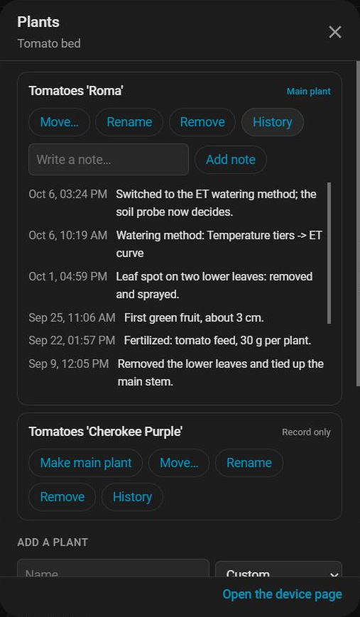
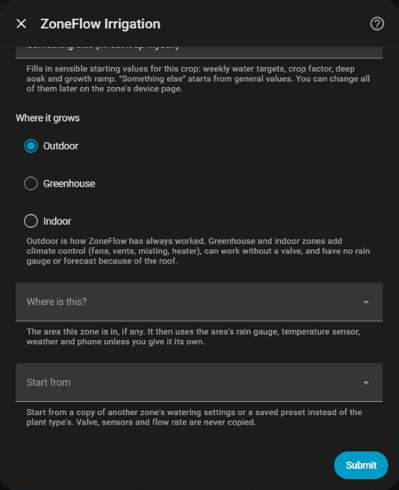
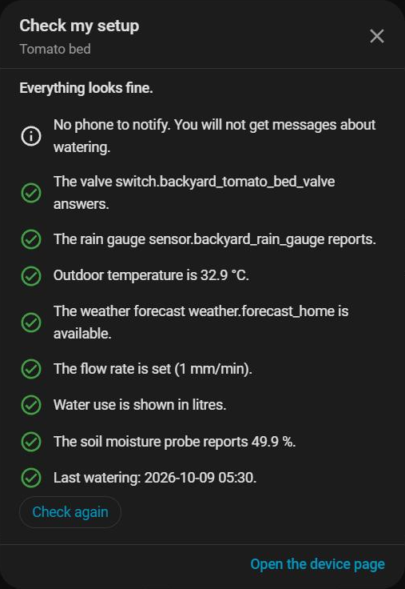

# Areas, plants and easy setup

ZoneFlow 1.7.0 adds areas, plants with a history of their own, presets, and a set of helpers that make a new garden quicker to set up.

## Areas

An **area** is a part of your garden, for example *Backyard* or *Front yard*. It holds the sensors its zones have in common:

- the rain gauge (and the size of one tip),
- the outdoor temperature sensor,
- the weather entity for the forecast,
- the phone that gets the messages.

Set them once on the area, and every zone in it uses them. A zone that has a sensor of its own keeps using that one, and its card says so ("Uses its own rain gauge, not Backyard's").

**Make an area:** Settings → Devices & services → ZoneFlow → **Add entry** → *Add an area*. Or open a zone's **Configure → Where is this?** and choose *New area*, which makes the area from that zone's own sensors and puts the zone in it. On the zone card, the **Where is this?** dropdown has *New area…* too.

**Move a zone** to another area, to a greenhouse (as a crop) or to nowhere with the same dropdown. A sensor the zone has that is the same as the area's is dropped (the area's is used); a different one stays as the zone's own, unless you choose to use the area's.

**Pause and Snooze for the whole area.** Each area has its own **Pause** switch and **Snooze Today** button. Pausing an area pauses all its zones; a zone's own Pause is separate and stays as it was when the area resumes. The overview card and the generated dashboard show both on the area's heading.

An area also adds up the litres its zones used (last 30 days, this year).

Zones that are in no area work exactly as before.

## Plants

A zone is a place: valve, soil, slope, flow. The **plant** in it is the living thing, with a name, a type, a planting date, its watering targets and care settings, and a **history**: planted, fertilized, a setting changed, moved, removed, notes.

The plant's settings stay where they always were, on the zone's own sliders and selects, so dashboards and automations keep working. Each zone with a valve gets one *main plant* when you update; it is the one that decides the watering. Other plants in the same zone are *records only*: history and notes, no effect on the watering.

Open a zone card's **Plants** button to:

- see the plants and each one's **History** (settings changed, notes, moves),
- **add a plant** (a record only, or one that takes over the zone),
- **move** a plant to another zone, with its history. If that zone already has a main plant, you choose what becomes of it: it stays as a record, it is archived, it swaps places with the moved plant, or the moved plant joins as a record only. The bed keeps the way it is watered (method, targets, deep soak); the plant brings its own planting date, health and fertilizing. Tick *Also use this plant's watering settings* to bring those across too (`use_plant_settings`),
- **rename** a plant,
- **make** a record the main plant (the bed again keeps its watering unless you ask for the plant's settings, `use_plant_settings`), **remove** a plant (it stays on record, archived), and write a **note**.

The same actions are services: `zoneflow.add_plant`, `move_plant`, `set_main_plant`, `remove_plant`, `rename_plant`, `add_plant_note`.

### Nursery plants: ready to move (1.7.1)

Seedlings in a nursery tray are followed towards the day they can go to their bed. In the Plants popup, a plant of a type that is raised from seed (tomatoes, chilis, leafy vegetables, herbs, strawberries, flowers) shows *Ready to move after (days)*, pre-filled with the usual number for the type (tomatoes 42, chilis 56, leafy vegetables 28, herbs 35, strawberries 42, flowers 42). Press **Follow** and give the planting date; change the number to what suits your seeds. A plant that is not followed shows nothing.

- The stage comes from the days since planting: **Seed**, **Seedling**, then **Ready to move**. The popup says how many days are left.
- A plant that is ready is shown on the zone card and on its row in the overview (*Ready to move: Basil*).
- One phone message says when a plant becomes ready. Open the zone's Plants popup and move it.
- A plant you move becomes **Established**; ZoneFlow never moves anything by itself.
- Services: `zoneflow.set_plant_ready` (`plant_id`, `ready_days`, `planted`; 0 stops following it; leaving the days out uses the usual number for the type), and `ready_days` / `planted` on `zoneflow.add_plant`.

## Copy settings and presets

Starting a new bed from an existing one is quick:

- **Copy settings** (Plants popup, or `zoneflow.copy_settings`) gives a zone another zone's watering settings: targets, thresholds, pulses, soak times, deep soak, schedule times, soil, method and so on. It never copies the valve, sensors, flow rate, rain gauge tip size, planting date or notes.
- **Presets** are such a set of settings saved under a name (*Save this zone's settings as a preset*, or `zoneflow.save_preset`). Use one on any zone later with **Use preset**.
- When you add a new zone, the first screen has **Quick setup** (ticked): ZoneFlow then asks only for the valve and how the water is delivered, uses the sensors it clearly found, and takes the rest from the plant type and the default climate. Everything can be changed later in Configure; untick it for the full set of questions (1.7.1).
- When you add a new zone, the first screen has **Start from**: a copy of another zone or a saved preset, instead of the plant type's usual settings.

## Easy setup

- **Check my setup** (a zone card button) is a plain checklist: is the valve answering, do the sensors report, is the flow rate set, when did it last water. Problems come first and say what to do.
- **Calibrate the flow rate** (a zone card button): run the valve for 15 minutes, catch the water, enter how much came out and the area, and the flow rate and Zone Flow are set. See also [Calibration](CALIBRATION.md).
- **Water now for N minutes:** a stepper on the card (`zoneflow.water_now`). Safe: not while paused, never longer than the zone's runtime cap, inside the day's cap. It counts in the water record (litres) but does not move the routine or deep soak schedule.
- **Why?** under the status shows the numbers behind the next watering: method, temperature, weekly target, rain credit, what it would water now, forecast skips and soil moisture.
- **Simple view:** a card option (on by default for new cards). It shows the status, Water now, Snooze and Pause; everything else is behind **Advanced settings**.
- **Likely entities in setup:** the form lists the rain gauges, thermometers, weather entities, phones and valves it finds, with their names and current values, and fills in a clear single match. A "Step 2 of 4" counter shows where you are.
- **Phone buttons:** messages to the Home Assistant companion app about a watering cancelled for rain, an overdue zone or a fertilizing reminder carry buttons: *Water 10 min*, *Snooze today*, *Fertilized*.
- **Fix buttons in Repairs:** a phone that no longer exists, a sensor that has been offline for days and a flow rate that was never set can be fixed on the spot.
- **One-click dashboard:** the overview card has a *Create a ZoneFlow dashboard* button for administrators.
- **My Garden:** the overview card starts with today at a glance: what is watering now, the next watering, rain today, zones that need a look, and the water used in 30 days.
